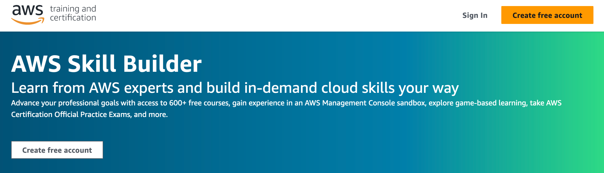
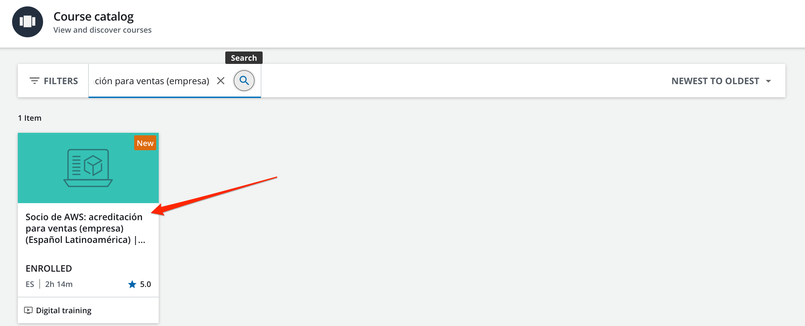

+++ 
title = "Acreditaciones Partners AWS" 
chapter = true 
weight = 1 
+++

## Pasos para registro a las clases digitales - Acreditaciones Sales y Technical

1. Ingresar	 a <a href="https://skillbuilder.aws/" target="_blank">AWS Skill Builder</a>

	

1. Click en **Sign In**

1. Seleccionar **AWS Partner**

	

1. Ingresar sus credenciales de **AWS Partner Central**

1. Una vez autenticado, seleccionar las 3 barras horizontales en la esquina superior derecha

	

1. Seleccionar **Course catalog**

1. En el cuadro de busqueda, ingresar:

	1. Para la acreditación Sales: **Socio de AWS: acreditación para ventas (empresa)**

	1. Para la acreditación Técnica: **AWS Partner: acreditación (técnico) (Español LATAM) | AWS Partner: Accreditation (Technical) (LATAM Spanish)**

1. Dar click en el curso

	

1. Hacer click en **START LEARNING NOW**

	